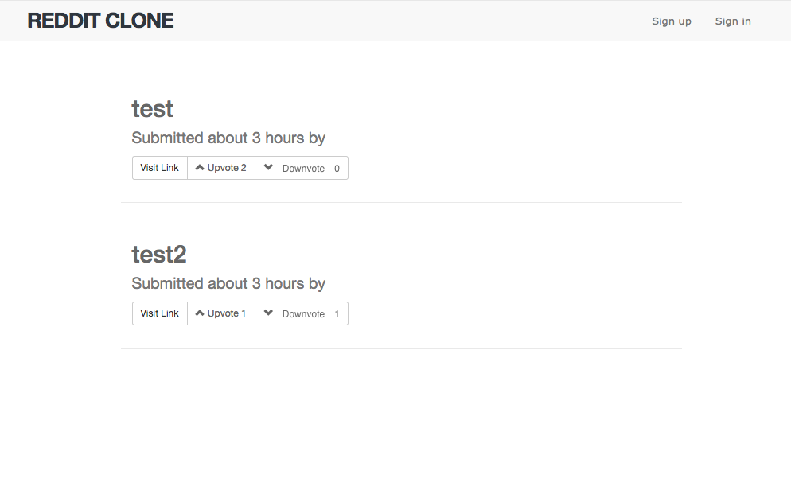
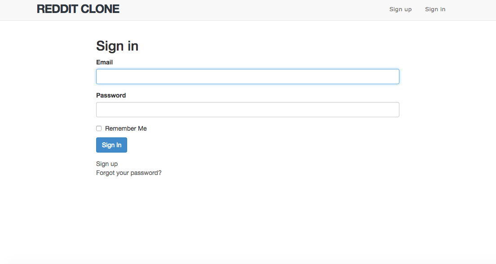
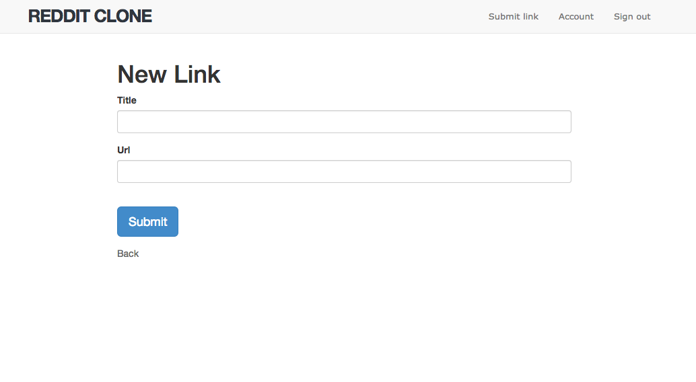
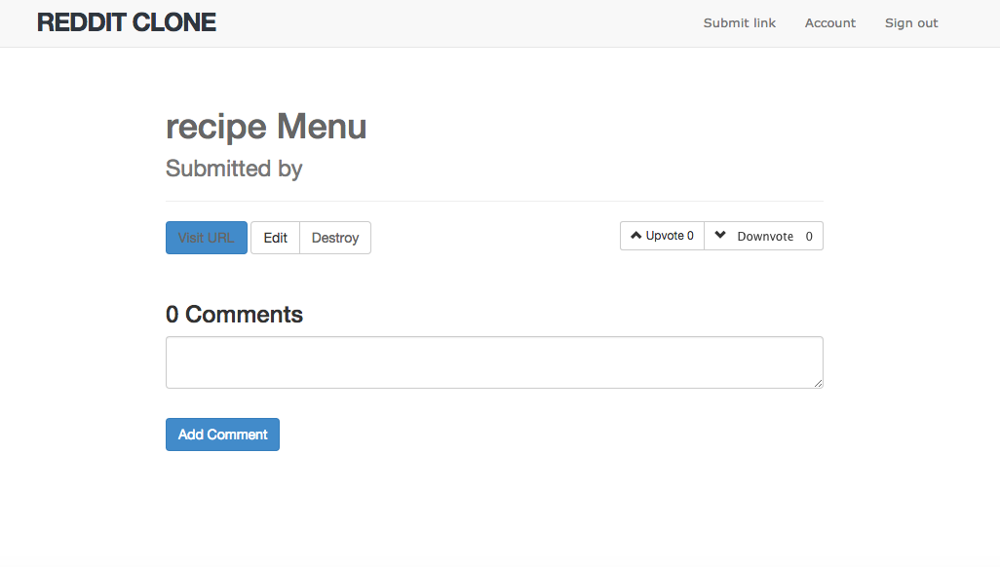

#README

This is a Reddit Clone that I built to practice implementing devise and some other handy gems such as acts_as_votable

####A User can view all the submitted links and vote for them without logging in.

####A User Can Sign in/up via Devise.

####A user Can Submit a link.

####A logged in user can view links as well.
